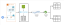

# Automated Data Pipeline for Slowly Changing Dimensions (SCD)

## 📝 Project Overview

This project implements a fully automated, cloud-based Extract, Load, Transform (ELT) data pipeline designed to manage and track Slowly Changing Dimensions (SCD) within a Snowflake Data Warehouse. The pipeline leverages AWS for infrastructure, Apache NiFi for data ingestion, and Snowflake’s native features (Snowpipe, Streams, and Tasks) to automate transformation logic for SCD Types 1, 2, 3, and 4. The goal is to ensure accurate tracking of historical changes to dimensional attributes (e.g., customer addresses) for robust business intelligence and reporting.

## 🚀 Architecture and Data Flow

The architecture follows a decoupled, highly automated ELT pattern, enabling near real-time data ingestion and scheduled transformations.

### Data Flow Architecture

1. **Extraction & Generation (Jupyter/Faker)**: Synthetic customer data is generated in a controlled environment using Jupyter Lab on an AWS EC2 instance.
2. **Ingestion (NiFi)**: Apache NiFi monitors the local filesystem and securely pushes new data files to an AWS S3 bucket (Data Lake).
3. **Loading (Snowpipe)**: Snowpipe monitors the S3 bucket and ingests new files into the Snowflake staging table (`customer_raw`).
4. **Transformation (Streams & Tasks)**: Snowflake Tasks execute Stored Procedures that read from Streams on the staging data, applying SCD logic to target dimension tables.



## 🛠️ Technology Stack

| **Category** | **Tool/Service** | **Purpose in Project** |
| --- | --- | --- |
| Data Warehouse | Snowflake | Core data platform, leveraging hybrid architecture for scalable compute (Virtual Warehouse). |
| Cloud Infrastructure | AWS EC2 & S3 | EC2 hosts ingestion tools; S3 acts as the secure landing zone (external stage). |
| Data Ingestion | Apache NiFi | Automates secure file movement from EC2 filesystem to S3. |
| Orchestration | Snowflake Tasks | Schedules execution of SCD logic (Stored Procedures) periodically. |
| Change Data Capture | Snowflake Streams | Detects row-level DML changes to enable efficient SCD processing. |
| Data Generation | Python / Faker | Creates realistic, high-volume test data to simulate transactional feeds. |
| Environment | Docker / Docker Compose | Containerizes NiFi and Jupyter Lab for consistent environment setup. |

## ❄️ Snowflake Components Deep Dive

Snowflake’s cloud-native capabilities automate the ELT process:

| **Component** | **Description** | **Role in Project** |
| --- | --- | --- |
| Warehouse | Virtual clusters of compute resources. | Provides scalable CPU/memory for running complex MERGE and stored procedures. |
| Snowpipe | Continuous, serverless data loading service. | Automates the Load stage from S3 to staging tables. |
| Stream | Detects row-level DML changes (metadata). | Enables efficient Change Data Capture (CDC) for Type 2 and Type 4 implementations. |
| Task | Schedules a single SQL statement or Stored Procedure. | Orchestrates periodic execution of the Transform stage. |
| Stored Procedure | Extends SQL with JavaScript logic. | Encapsulates complex MERGE INTO logic for SCD Types 1, 2, 3, and 4. |

## 🔄 Slowly Changing Dimension (SCD) Implementation

Snowflake primitives are combined to implement various historical tracking strategies:

### 1. SCD Type 1: Overwrite (No History)

- **Concept**: Overwrites existing data; historical values are lost.
- **Mechanism**: Simple `MERGE INTO` statement in a Stored Procedure, scheduled by a Task.
- **Use Case**: Correcting typos or storing attributes where history is not needed (e.g., current account status).

### 2. SCD Type 2: Full History Tracking

- **Concept**: Preserves complete history by inserting a new row for every change.
- **Version Columns**: Uses effective dating (`start_date`, `end_date`) and a flag (`is_active` or `is_current`).

| customer_id | first_name | city | start_date | end_date | is_active |
| --- | --- | --- | --- | --- | --- |
| 1 | John | Hyderabad | 01/01/2021 | 10/01/2021 | NO |
| 1 | John | Delhi | 10/02/2021 | 9999-12-31 | YES |

- **Mechanism**: Stream detects changes, Stored Procedure updates `end_date` of the old row and inserts a new active row.

### 3. SCD Type 3: Partial History (Previous Value)

- **Concept**: Tracks the current value and the immediately preceding value for specific columns.
- **Dedicated Columns**: Uses columns like `current_street` and `old_street`.

| customer_id | first_name | current_street | old_street | city |
| --- | --- | --- | --- | --- |
| 1 | John | Some street 1 | Some street | Hyderabad |

- **Mechanism**: `MERGE` logic swaps `current_street` to `old_street` before writing the new street to `current_street`.

## 💻 Environment Setup and Commands

The local environment (Jupyter and NiFi) is managed using Docker on an AWS EC2 instance.

### EC2 Setup & Access

- **Instance**: `t2.xlarge` recommended with 32GB storage. Ensure necessary Security Group ports are open.
- **Install Docker**: Run `sudo yum install docker` and configure user groups.
- **Start Services**: Execute `docker-compose up -d` (requires a `docker-compose.yml` defining Jupyter and NiFi services).
- **Access Tools (via SSH Port Forwarding)**:

  ```bash
  ssh -i "key.pem" ec2-user@<EC2_IP> -L 4888:localhost:4888 -L 2080:localhost:2080
  ```

### Data Generation & Staging

- Use a Python Faker script in Jupyter to generate files (e.g., `customer_20241012192443.csv`).
- NiFi detects these files and pushes them to the AWS S3 bucket.
- Snowpipe loads files into the `customer_raw` staging table in Snowflake.

## 💡 Reporting Context

This pipeline delivers clean, reliable dimension tables critical for accurate Star Schema reporting. By implementing SCD, Fact table events are linked to the correct dimensional state at the time of the event, ensuring time-variance in analysis (e.g., attributing sales to the correct customer location at the time of purchase).
